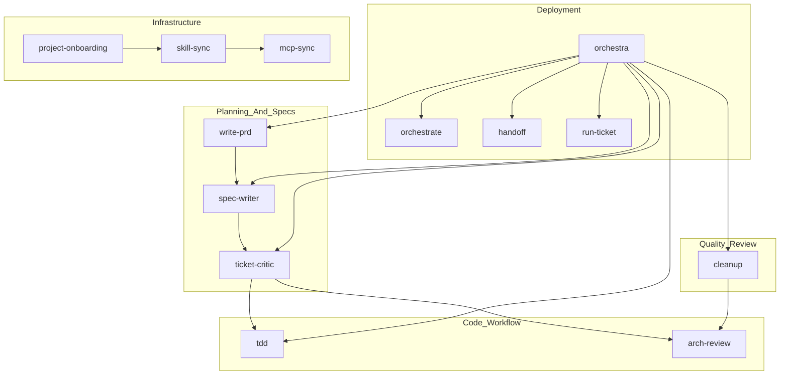

# Skill Dependency Graph

Documentation of how skills in `~/.skills/` reference each other. Maintained manually — check for circular references when editing.

## Mermaid Diagram



## Actual References (from code analysis)

| Skill | References |
|-------|-------------|
| **cleanup** | arch-review, chrome-devtools, make-ui, test-ui, ticket-critic |
| **orchestra** | cleanup, handoff, orchestrate, spec-writer, tdd, ticket-critic, write-prd |
| **ticket-critic** | orchestrate, spec-writer, tdd |
| **write-prd** | spec-writer |

## Circular Reference Check

Run this to verify no circular references:

```bash
cd ~/.skills
python -c "
import os, re
from collections import defaultdict

refs = defaultdict(set)
skills = [d for d in os.listdir('.') if os.path.isdir(d) and d != '.git']

for skill in skills:
    sk = skill + '/SKILL.md'
    if os.path.exists(sk):
        with open(sk, encoding='utf-8') as f:
            for line in f:
                for other in skills:
                    if other != skill and '**' + other + '**' in line:
                        refs[skill].add(other)

# Check for cycles using DFS
def has_cycle(node, visited, rec_stack, graph):
    visited.add(node)
    rec_stack.add(node)
    for neighbor in graph.get(node, []):
        if neighbor not in visited:
            if has_cycle(neighbor, visited, rec_stack, graph):
                return True
        elif neighbor in rec_stack:
            print(f'Cycle: {node} -> {neighbor}')
            return True
    rec_stack.remove(node)
    return False

visited = set()
for skill in refs:
    if skill not in visited:
        has_cycle(skill, visited, set(), refs)

print('OK: No circular refs' if not any(has_cycle(s, set(), set(), refs) for s in refs) else 'CYCLE DETECTED')
"
```

## Rules

1. **No circular references** — Skills should not reference each other in a cycle
2. **Prefer one-way references** — A skill can reference another, but the referenced skill should not reference back
3. **Check after edits** — Run the verification script after updating any skill
4. **Leaf skills** — tdd, arch-review, make-ui, test-ui, chrome-devtools don't reference other skills

## Last Verified

2026-04-03 — No circular references found
