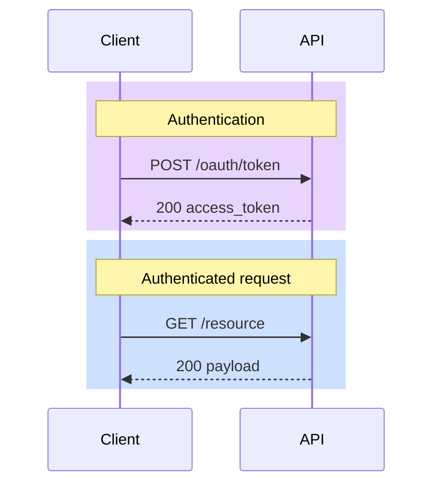

# make-mmd — Mermaid Authoring + Rendering

Produces `.mmd` sources and renders them to `.svg` with the shared C3 color
convention. Decouples "how the diagram looks" (this skill) from "where it ends
up" (consumer skills: `confluence-diagrams`, README embedding, etc.).

## Prerequisites

`@mermaid-js/mermaid-cli` installed globally:

```bash
npm install -g @mermaid-js/mermaid-cli
mmdc --version   # 10+ required
```

## When to use which rendering path

| Target | Approach |
|--------|----------|
| GitHub README / wiki, GitLab, most markdown viewers | Embed mermaid source in ` ```mermaid ` fenced block. Remove hardcoded `%%{init}%%` blocks to let GitHub's auto-theming adapt to user's light/dark mode. Use `rgba()` rect colors for mode-agnostic highlights. |
| Confluence, PDF, email, any static/image consumer | Render to SVG via `mmdc`. Produce a light + dark variant; pick at embed time. |

These two paths share one `.mmd` source. The difference is at render time.

## GitHub inline mermaid (markdown viewers)

For any diagram embedded in markdown (GitHub wikis, README files, etc.):

**DO:**
- Remove `%%{init}%%` blocks entirely — let GitHub's renderer auto-theme to the user's preference
- Use `rgba(R, G, B, 0.25)` for rect highlights and other fills — these blend with the host background
- Omit actor/text color overrides — GitHub handles contrast automatically

**DON'T:**
- Include `%%{init}%%` with hardcoded colors — this locks the diagram to light mode even in dark mode
- Use solid `rgb()` colors — they don't adapt to theme changes

**Example:**


The semi-transparent rects blend with both light and dark backgrounds, and GitHub's mermaid renderer auto-adapts text colors for readability.

## Authoring Rules

### 1. Parser safety

- **No `{}`** or HTML entities in labels — mermaid's parser trips on them.
- **Use `<br/>`** for line breaks in labels (not `\n`).
- **Avoid `classDef`** in `sequenceDiagram` and `stateDiagram-v2` — it only
  works in flowcharts.
- **Edge `linkStyle N`** is index-based and breaks when you reorder edges.
  Prefer solid-vs-dashed arrows and descriptive labels.

### 2. Semantic colors (the palette)

Mermaid diagrams use color to encode meaning, not decoration. Same palette
across flowchart `classDef` and sequence `rect`.

| Semantic | Role | Light hex | Dark hex | Mode-agnostic rgba() |
|----------|------|-----------|----------|-----------------------|
| `person` | User, browser, human actor | `#E8EAED` | `#374151` | `rgba(156,163,175,0.25)` |
| `service` | App, API, deployed service (sync call) | `#4285F4` | `#3B82F6` | `rgba(59,130,246,0.25)` |
| `library` | In-process library or module | `#4FC3F7` | `#38BDF8` | `rgba(56,189,248,0.25)` |
| `guard` | Security boundary, guardrail, policy (caution) | `#F9AB00` | `#F59E0B` | `rgba(245,158,11,0.25)` |
| `external` | External system outside your control | `#9AA0A6` | `#6B7280` | `rgba(107,114,128,0.25)` |
| `state` | State, data store, token, config (data/mutation) | `#A142F4` | `#A855F7` | `rgba(168,85,247,0.25)` |
| `errBlock` | Error state, blocked path | `#EA4335` | `#EF4444` | `rgba(239,68,68,0.25)` |
| `passNode` | Success outcome, data-in-motion | `#34A853` | `#22C55E` | `rgba(34,197,94,0.25)` |
| `auditNode` | Audit / logging / side-effect | `#9AA0A6` | `#6B7280` | `rgba(107,114,128,0.2)` |

### 3. Sequence diagrams — use `rect rgba(...)` for mode-agnostic highlight

Wrap token-acquisition, error paths, and multi-step sections in `rect` blocks.
Use the rgba column above — these read on both light and dark backgrounds
because semi-transparent fills blend with the host background.

```
sequenceDiagram
    participant Client
    participant API

    rect rgba(168, 85, 247, 0.25)
        Note over Client,API: Step 1 — Acquire token (state)
        Client->>API: POST /oauth/token
        API-->>Client: JWT
    end

    rect rgba(59, 130, 246, 0.25)
        Note over Client,API: Step 2-N — Authenticated calls (service)
        Client->>API: GET /resource  [Bearer JWT]
    end
```

**Do NOT** embed `%%{init}%%` with hardcoded actor/text colors in diagrams
intended for GitHub markdown rendering — that forces one theme and breaks
user dark-mode adaptation. Set theme only when rendering to static SVG with
a known target (§5).

### 4. Flowcharts — use `classDef` + the palette

```
flowchart LR
  classDef service fill:#4285F4,stroke:#1a73e8,color:#fff
  classDef state fill:#A142F4,stroke:#8430ce,color:#fff
  classDef errBlock fill:#EA4335,stroke:#c5221f,color:#fff

  API["API Gateway"]:::service
  Cache["Token Cache"]:::state
  Err["403 Blocked"]:::errBlock

  API --> Cache
  API -.-> Err
```

Always include a **Legend subgraph** when a diagram uses more than 5 node
classes — see [example-conventions.mmd](example-conventions.mmd).

### 5. Edge styles

| Style | Syntax | Meaning |
|-------|--------|---------|
| Solid + filled arrow | `A --> B` | Synchronous call |
| Solid + label | `A -->\|"POST /foo"\| B` | HTTP or labeled sync call |
| Dashed + filled arrow | `A -.-> B` | Async, streaming, exceptional path |
| Dotted + open arrow | `A -.-\|"side-effect"\| B` | Dependency, audit, optional |

## Rendering

### Default (GitHub wiki / README inline mermaid)

No render step needed — commit the `.mmd` source inside a ` ```mermaid `
fenced block. GitHub renders it with the user's theme (light/dark).

### Rendering to SVG (static consumers)

Render both modes from one source:

```bash
~/.skills/make-mmd/scripts/render.sh diagram.mmd
# produces: diagram.light.svg + diagram.dark.svg
```

The script wraps `mmdc` with the palette config files and emits both variants.
Consumers pick: for a Confluence light-theme page use `diagram.light.svg`;
for a dark-themed consumer use `diagram.dark.svg`; for ambient/auto use a
`<picture>` wrapper:

```html
<picture>
  <source media="(prefers-color-scheme: dark)" srcset="diagram.dark.svg">
  
</picture>
```

### Manual render (single mode)

```bash
mmdc -i diagram.mmd -o diagram.svg \
  -c ~/.skills/make-mmd/palettes/light.json \
  -b transparent
```

Swap `light.json` → `dark.json` for the dark variant. `-b transparent` keeps
the SVG background neutral so it picks up the host's page background.

## Layout rules (for complex flowcharts)

These matter when the SVG will be imported into a Confluence whiteboard or
any renderer with a dynamic connector router. Ignore for simple flowcharts.

### 1. Error-bus pattern — never fan-out block arrows

**Bad:** N guardrail nodes each connect individually to a single error node
far away → N diagonal arrows crossing the happy path.

**Good:** Add one local collector per cascade, then one outbound to error.

```
IG1 --> IG2 --> IG3 --> IG4
IG4 --> PassInput

IG1 & IG2 & IG3 & IG4 -.-> InputErr["⛔ Block"]:::errBlock
InputErr -.-> BlockInput
```

### 2. Cascade-local outcomes

Keep pass/block nodes inside or immediately after their subgraph. Rule of
thumb: no arrow should span more than ~800 px horizontally.

### 3. One exit per subgraph

Each subgraph should expose one outbound happy-path connector and one
outbound error connector. Internal fan-out stays inside.

### 4. Consistent anchor direction

For horizontal cascades (LR flow), all connectors use:
- **Source:** right-center `{left: 1, top: 0.5}`
- **Target:** left-center `{left: 0, top: 0.5}`

Never mix (e.g., bottom-center → left-center) — forces steep diagonals the
router cannot clean up.

### 5. Max one subgraph crossing per arrow

If an arrow must cross more than one subgraph boundary, introduce an
intermediary node at the boundary.

### 6. Audit/side-effect aggregation

Instead of 3 separate section→Audit arrows, add one invisible aggregation
node:

```
InputCascade -.-> AuditBus[" "]
OutputCascade -.-> AuditBus
ToolCascade -.-> AuditBus
AuditBus -.-|"all results logged"| Audit
```

## Files in this skill

| File | Purpose |
|------|---------|
| [palettes/light.json](palettes/light.json) | `mmdc -c` config — light-mode theme variables |
| [palettes/dark.json](palettes/dark.json) | `mmdc -c` config — dark-mode theme variables |
| [scripts/render.sh](scripts/render.sh) | Render a `.mmd` to both light + dark SVGs |
| [example-conventions.mmd](example-conventions.mmd) | Flowchart showing the full palette + legend |
| [example-sequence.mmd](example-sequence.mmd) | Sequence diagram using `rect rgba()` |

## Relation to other skills

- **`confluence-diagrams`** — consumer. Use this skill to render `.mmd` →
  `.svg`; then use `confluence-diagrams` to upload + embed in Confluence.
- **`reframe`** — producer. When reframe generates diagrams, it writes
  `.mmd` that follow this skill's conventions.
- **`brief-docs`** — producer. Diagrams in brief docs should follow these
  conventions for consistency.

## Verification

Before committing diagrams:

- [ ] Each semantic color matches the palette table (§2).
- [ ] Sequence rects use `rgba(...)` not solid `rgb(...)` — otherwise dark
      mode viewers see the same fill as light mode.
- [ ] No hardcoded `%%{init}%%` in files destined for GitHub markdown.
- [ ] Flowcharts with >5 node classes include a Legend subgraph.
- [ ] Render both modes and eyeball: `./scripts/render.sh diagram.mmd &&
      open diagram.{light,dark}.svg`.
