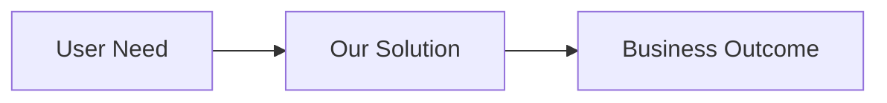
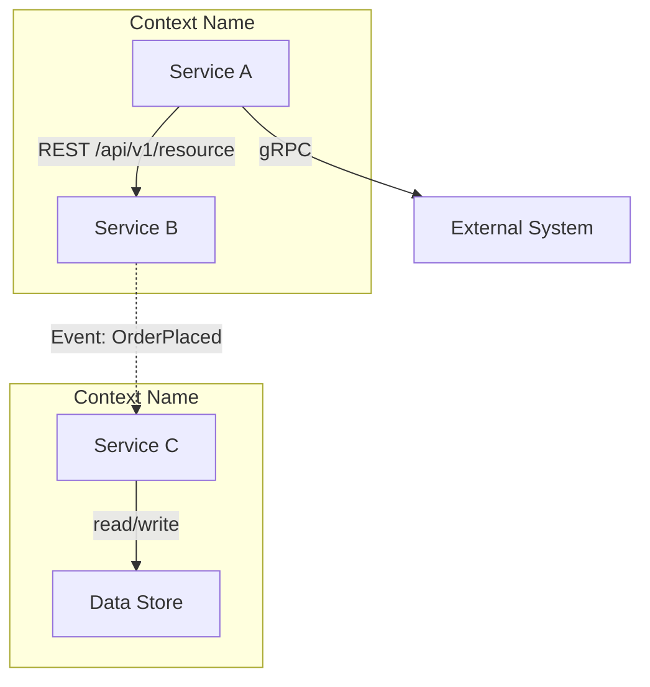
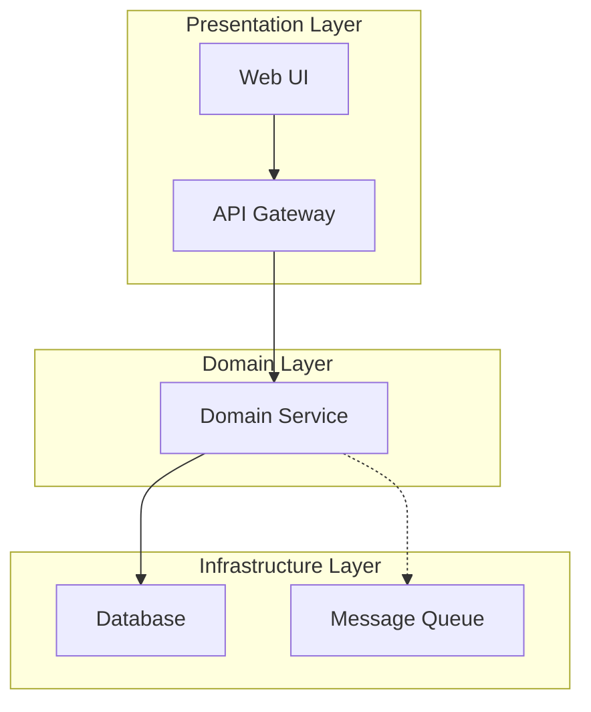
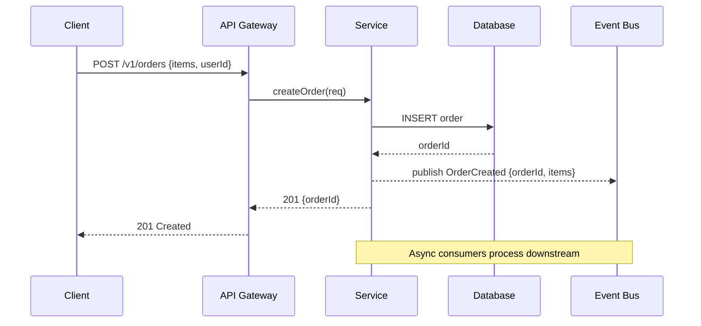
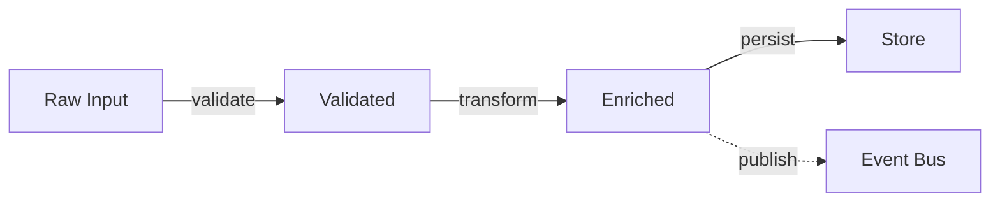
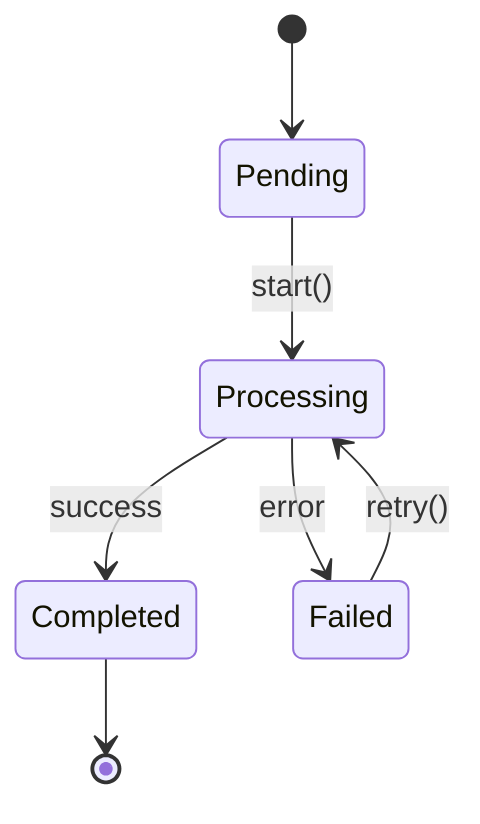

# Diagram Patterns

## Contents

- [Style Reference](#style-reference)
- [Exec Diagrams](#exec-diagrams)
- [Architect Diagrams](#architect-diagrams)
- [Engineer Diagrams](#engineer-diagrams)
- [Diagram Selection Heuristic](#diagram-selection-heuristic)

---

Mermaid diagram patterns for each audience mode. Render with:
```bash
mmdc -i <file>.mmd -o <file>.svg -b transparent    # standalone
mmdc -i <file>.mmd -o <file>.png -b white -w 1200   # for PPTX embedding
```

## Style Reference

Reuse `classDef` conventions from `~/.skills/confluence-diagrams/example-conventions.mmd`:

```mermaid
classDef person fill:#E8EAED,stroke:#9AA0A6,color:#000
classDef service fill:#4285F4,stroke:#1a73e8,color:#fff
classDef library fill:#4FC3F7,stroke:#0097A7,color:#000
classDef guard fill:#F9AB00,stroke:#e8a000,color:#000
classDef external fill:#9AA0A6,stroke:#6e7479,color:#fff
classDef state fill:#A142F4,stroke:#8430ce,color:#fff
classDef errBlock fill:#EA4335,stroke:#c5221f,color:#fff
classDef passNode fill:#34A853,stroke:#1e8e3e,color:#fff
```

**Edge conventions:**
- Solid arrow (`-->`) = synchronous call
- Dashed arrow (`-.->`) = async / streaming / error path
- Label edges with operation name and key payload

**Legend:** Include a `subgraph Legend` for diagrams with more than 5 nodes.

## Exec Diagrams

Rarely used. Only when explicitly requested. Keep to 3-5 nodes.



- No technical labels. Use business language on nodes and edges.
- No subgraphs or nested structure.
- Value or impact labels on edges ("saves $X/yr", "reduces time by Y%").

## Architect Diagrams

Default diagram type: **component diagram** (`flowchart TB`).

**Component diagram pattern:**


**Always show:** system boundaries (subgraphs), external systems, data stores,
sync vs async edges, protocol labels.

**Layered view pattern** (for showing architectural layers):


**Current vs target state:** Use two separate diagrams side by side, labeled
"Current State" and "Target State". Highlight changes with color or annotations.

## Engineer Diagrams

Default diagram type: **sequence diagram**.

**Sequence diagram pattern:**


**Always show:** error paths (alt/opt blocks), async operations, concrete
endpoint names, payload shapes.

**Data flow pattern** (`flowchart LR`):


**State machine pattern** (`stateDiagram-v2`):


## Diagram Selection Heuristic

| Source content describes... | Exec | Architect | Engineer |
|----------------------------|-------|-----------|----------|
| System components and interactions | skip | Component diagram | Sequence diagram |
| Data pipeline or transformations | skip | Component diagram | Data flow diagram |
| Stateful process or lifecycle | skip | Component diagram | State machine |
| Migration or evolution | skip | Current vs target | Sequence + data flow |
| Simple business flow | Flowchart (if requested) | Component diagram | Sequence diagram |
